# UrbanEase — Entity Relationship Diagram

> Rendered in VS Code with the **Markdown Preview Mermaid Support** extension, or view on GitHub directly.

```mermaid
erDiagram

    %% ─── CORE USERS ───────────────────────────────────────────────

    ADMIN {
        ObjectId _id
        string   name
        string   email
        string   password
        string   profileImage
        date     createdAt
    }

    COMMUNITY_MANAGER {
        ObjectId _id
        string   name
        string   email
        string   password
        string   contact
        string   profileImage
        ObjectId assignedCommunity
        date     createdAt
    }

    RESIDENT {
        ObjectId _id
        string   residentFirstname
        string   residentLastname
        string   email
        string   password
        string   contact
        string   uCode
        ObjectId community
        string   flatNo
        string   profileImage
        array    notifications
        date     createdAt
    }

    SECURITY {
        ObjectId _id
        string   name
        string   email
        string   password
        string   contact
        string   Shift
        string   workplace
        ObjectId community
        date     joiningDate
    }

    WORKER {
        ObjectId _id
        string   name
        string   email
        string   contact
        string   address
        string   jobRole
        boolean  isActive
        ObjectId community
        date     joiningDate
    }

    %% ─── COMMUNITY CORE ────────────────────────────────────────────

    COMMUNITY {
        ObjectId _id
        string   name
        string   communityCode
        string   location
        string   description
        ObjectId communityManager
        string   subscriptionStatus
        date     planEndDate
        string   bookingRules
        date     createdAt
    }

    BLOCK {
        ObjectId _id
        string   name
        ObjectId community
        number   totalFloors
        number   flatsPerFloor
    }

    FLAT {
        ObjectId _id
        string   flatNumber
        number   floor
        string   status
        string   registrationCode
        ObjectId residentId
        ObjectId block
        ObjectId community
    }

    %% ─── OPERATIONS ────────────────────────────────────────────────

    ISSUE {
        ObjectId _id
        string   issueID
        string   title
        string   description
        string   category
        string   status
        string   priority
        string   location
        ObjectId community
        ObjectId resident
        ObjectId workerAssigned
        ObjectId payment
        date     createdAt
    }

    PAYMENT {
        ObjectId _id
        string   title
        number   amount
        string   status
        string   paymentMethod
        ObjectId sender
        ObjectId receiver
        ObjectId community
        string   belongTo
        ObjectId belongToId
        string   remarks
        date     paymentDeadline
        date     paymentDate
    }

    VISITOR {
        ObjectId _id
        string   name
        string   email
        string   contactNumber
        string   purpose
        string   vehicleNumber
        string   status
        ObjectId community
        ObjectId approvedBy
        date     scheduledAt
        date     checkInAt
        date     checkOutAt
    }

    VISITOR_PRE_APPROVAL {
        ObjectId _id
        string   visitorName
        string   contactNumber
        string   purpose
        string   vehicleNo
        string   status
        string   qrStatus
        date     dateOfVisit
        string   timeOfVisit
        ObjectId community
        ObjectId approvedBy
    }

    COMMON_SPACES {
        ObjectId _id
        string   name
        string   description
        string   Type
        string   status
        string   paymentStatus
        number   amount
        date     Date
        string   from
        string   to
        string   availability
        string   feedback
        ObjectId community
        ObjectId bookedBy
        ObjectId payment
    }

    AMENITY {
        ObjectId _id
        string   name
        string   type
        boolean  bookable
        number   rent
        string   bookingRules
        string   Type
        ObjectId community
    }

    LEAVE {
        ObjectId _id
        string   type
        date     startDate
        date     endDate
        string   reason
        string   status
        string   notes
        date     appliedAt
        ObjectId worker
        ObjectId manager
        ObjectId community
    }

    AD {
        ObjectId _id
        string   ID
        string   title
        date     startDate
        date     endDate
        string   imagePath
        string   link
        string   status
        string   adType
        string   targetAudience
        ObjectId community
    }

    %% ─── ADMIN / SYSTEM ────────────────────────────────────────────

    INTEREST_FORM {
        ObjectId _id
        string   firstName
        string   lastName
        string   email
        string   phone
        string   communityName
        string   location
        string   description
        string   status
        string   paymentStatus
        date     createdAt
    }

    COMMUNITY_SUBSCRIPTION {
        ObjectId _id
        ObjectId communityId
        string   transactionId
        string   planName
        string   planType
        number   amount
        string   paymentMethod
        date     paymentDate
        date     planStartDate
        date     planEndDate
        string   duration
        string   status
    }

    ADMIN_AUDIT_LOG {
        ObjectId _id
        ObjectId adminId
        string   adminEmail
        string   action
        string   targetType
        ObjectId targetId
        string   targetName
        string   status
        string   ip
        date     createdAt
    }

    NOTIFICATIONS {
        ObjectId _id
        string   type
        string   title
        string   message
        boolean  read
        ObjectId referenceId
        string   referenceType
        date     expiresAt
        date     createdAt
    }

    %% ─── RELATIONSHIPS ─────────────────────────────────────────────

    %% Community hierarchy
    COMMUNITY          ||--o|  COMMUNITY_MANAGER    : "managed by"
    COMMUNITY          ||--o{  BLOCK                : "has"
    COMMUNITY          ||--o{  FLAT                 : "contains"
    BLOCK              ||--o{  FLAT                 : "houses"
    FLAT               ||--o|  RESIDENT             : "occupied by"

    %% Community → Users
    COMMUNITY          ||--o{  RESIDENT             : "belongs to"
    COMMUNITY          ||--o{  WORKER               : "employs"
    COMMUNITY          ||--o{  SECURITY             : "employs"

    %% Community → Operations
    COMMUNITY          ||--o{  ISSUE                : "has"
    COMMUNITY          ||--o{  VISITOR              : "has"
    COMMUNITY          ||--o{  VISITOR_PRE_APPROVAL : "has"
    COMMUNITY          ||--o{  COMMON_SPACES        : "has"
    COMMUNITY          ||--o{  AMENITY              : "has"
    COMMUNITY          ||--o{  LEAVE                : "has"
    COMMUNITY          ||--o{  AD                   : "displays"
    COMMUNITY          ||--o{  PAYMENT              : "has"
    COMMUNITY          ||--o{  COMMUNITY_SUBSCRIPTION: "subscribed via"

    %% Resident actions
    RESIDENT           ||--o{  ISSUE                : "raises"
    RESIDENT           ||--o{  VISITOR              : "approves"
    RESIDENT           ||--o{  VISITOR_PRE_APPROVAL : "creates"
    RESIDENT           ||--o{  COMMON_SPACES        : "books"
    RESIDENT           ||--o{  PAYMENT              : "pays (sender)"

    %% Worker / Issue
    WORKER             ||--o{  ISSUE                : "assigned to"
    WORKER             ||--o{  LEAVE                : "applies"

    %% Issue / Payment
    ISSUE              ||--o|  PAYMENT              : "linked payment"

    %% Common Spaces / Payment
    COMMON_SPACES      ||--o|  PAYMENT              : "linked payment"

    %% Manager involvement
    COMMUNITY_MANAGER  ||--o{  LEAVE                : "approves"
    COMMUNITY_MANAGER  ||--o{  PAYMENT              : "receives"

    %% Admin
    ADMIN              ||--o{  ADMIN_AUDIT_LOG      : "generates"
    ADMIN              ||--o{  INTEREST_FORM        : "reviews"
    ADMIN              ||--o{  COMMUNITY            : "manages"
```



---

## Relationship Summary

| Relationship | Type | Description |
|---|---|---|
| Community → CommunityManager | One-to-One | Each community has exactly one manager |
| Community → Resident | One-to-Many | Many residents belong to one community |
| Community → Worker | One-to-Many | Workers are employed by one community |
| Community → Block | One-to-Many | A community has multiple blocks |
| Block → Flat | One-to-Many | A block contains multiple flats |
| Flat → Resident | One-to-One (optional) | A flat may be occupied by one resident |
| Resident → Issue | One-to-Many | A resident can raise many issues |
| Issue → Worker | Many-to-One | An issue is assigned to one worker |
| Issue → Payment | One-to-One (optional) | An issue may generate one payment |
| CommonSpaces → Payment | One-to-One (optional) | A booking generates one payment |
| Payment (belongTo) | Polymorphic | Links to Issue, CommonSpaces, or Resident |
| Resident → Visitor | One-to-Many | A resident pre-approves multiple visitors |
| Admin → AdminAuditLog | One-to-Many | Admin actions are logged |
| Community → CommunitySubscription | One-to-Many | Subscription history per community |

---

## Notes on Polymorphic Relationships

`Payment.belongToId` uses `refPath: 'belongTo'` to dynamically resolve its reference:

```
belongTo = "Issue"        → belongToId refs Issue
belongTo = "CommonSpaces" → belongToId refs CommonSpaces
belongTo = "Resident"     → belongToId refs Resident (onboarding fees)
```

This was a schema bug that was fixed in the P2 optimization phase.
